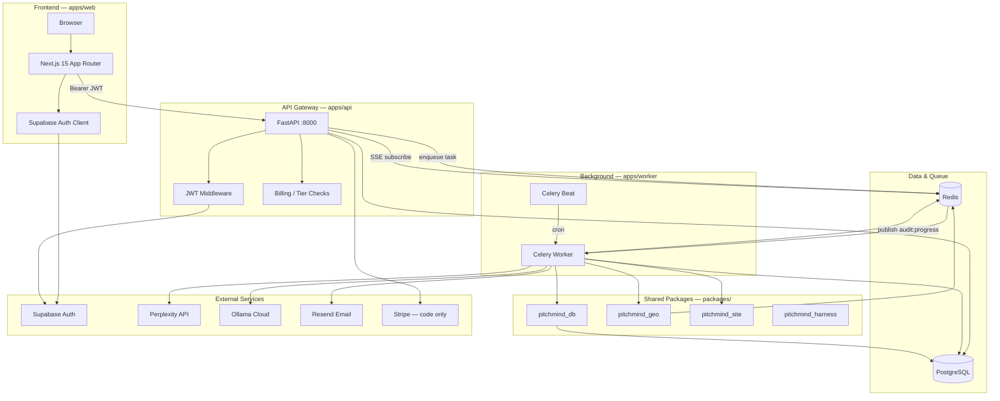
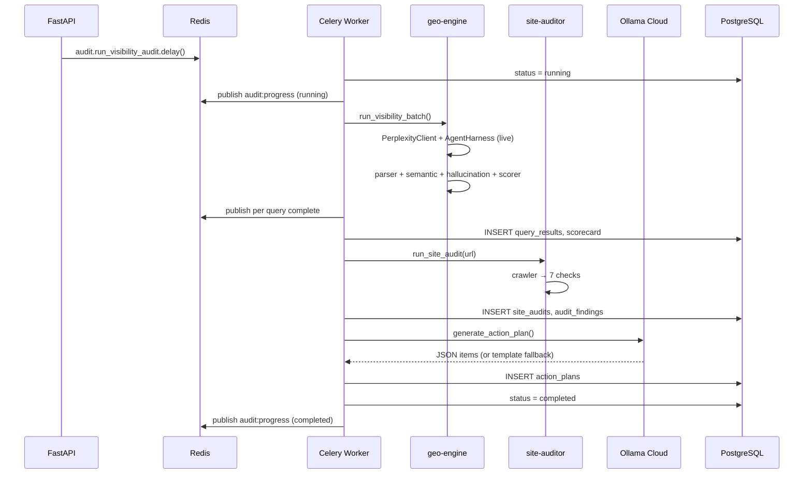
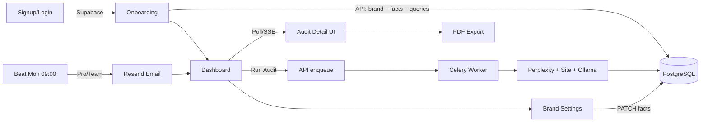

# PitchMind — Repository Structure & Architecture Map

> Last updated: 2026-06-13  
> Scope: final architecture as implemented in `projects/pitchmind/`  
> Companion: [README.md](README.md) · [system-design.md](projects/pitchmind/system-design.md)

This document maps **where each layer lives**, **what it does**, and **how components connect**.

---

## 1. High-level system



**Request path (typical):** Browser → Next.js → Supabase login → JWT attached to API calls → FastAPI validates → reads/writes PostgreSQL or enqueues Celery task → Worker calls AI APIs → results stored → Web polls/SSE for status (SSE via Redis pub/sub `audit:progress:{id}`).

---

## 2. Monorepo layout

```
projects/pitchmind/
│
├── apps/                          # Runnable applications
│   ├── web/                       # FRONTEND (TypeScript)
│   ├── api/                       # BACKEND API (Python / FastAPI)
│   └── worker/                    # BACKGROUND WORKER (Python / Celery)
│
├── packages/                      # Shared libraries (imported by api + worker)
│   ├── db/                        # Database layer
│   ├── geo-engine/                # AI visibility engine
│   ├── site-auditor/              # Website crawl + checks
│   └── harness/                   # AgentHarness: budget, circuit breaker, retry
│
├── infra/                         # Dev & deploy config
│   ├── docker-compose.yml         # Local Postgres + Redis
│   ├── railway.toml               # Railway API deploy
│   └── railway.worker.toml        # Railway worker deploy
│
├── tests/
│   ├── unit/                      # Unit + API route tests
│   ├── integration/               # Pipeline integration test
│   └── eval/                      # ML eval dataset + metrics gate
│
├── Makefile                       # dev-up, api, web, worker, beat, migrate, test, lint
├── pyproject.toml                 # Python deps (api + worker + packages)
└── .env.example                   # All env vars documented
```

---

## 3. Frontend — `apps/web`

**Role:** User-facing UI, auth session, i18n, calls REST API with Supabase JWT.

| Path | File | Connects to |
|------|------|-------------|
| `/[locale]` | `app/[locale]/page.tsx` | Landing (static) |
| `/[locale]/login` | `login/page.tsx` | **Supabase Auth** (email + Google) |
| `/[locale]/signup` | `signup/page.tsx` | **Supabase Auth** → redirect onboarding |
| `/auth/callback` | `auth/callback/route.ts` | Supabase OAuth callback |
| `/[locale]/onboarding` | `onboarding/page.tsx` | **API** `POST /workspaces`, `/brands`, `/competitors`, `/queries/seed` |
| `/[locale]/dashboard` | `dashboard/page.tsx` | **API** workspaces, brands, scorecards, audits |
| `/[locale]/dashboard/brands/[id]` | `brands/[id]/page.tsx` | Brand overview + **RunAuditButton** → API |
| `/[locale]/dashboard/brands/[id]/settings` | `brands/[id]/settings/page.tsx` | **BrandSettingsPanel** → API brand CRUD |
| `/[locale]/dashboard/brands/[id]/audits/[auditId]` | `audits/[auditId]/page.tsx` | **API** audit detail, PDF export |
| `/[locale]/dashboard/settings` | `dashboard/settings/page.tsx` | **BillingPanel** + **EmailPrefsPanel** → API billing + account |

### Key frontend modules

| Module | Location | Talks to |
|--------|----------|----------|
| Auth session | `lib/supabase/client.ts`, `server.ts` | Supabase Auth |
| API client (browser) | `lib/api.ts` | `NEXT_PUBLIC_API_URL` → FastAPI |
| API client (SSR) | `lib/api-server.ts` | Same, server-side fetch |
| Route protection | `middleware.ts` | Supabase session check for `/dashboard`, `/onboarding` |
| i18n | `i18n/routing.ts`, `messages/en.json`, `id.json` | — |
| Run audit + poll | `components/RunAuditButton.tsx` | `POST /brands/{id}/audits` → poll `GET /audits/{id}` |
| Hallucination UI | `components/QueryResultsTable.tsx` | Renders flags from API audit detail |
| PDF download | `components/ExportPdfButton.tsx` | `GET /audits/{id}/export/pdf` |

**Env vars (web):** `NEXT_PUBLIC_SUPABASE_URL`, `NEXT_PUBLIC_SUPABASE_ANON_KEY`, `NEXT_PUBLIC_API_URL`

---

## 4. Backend API — `apps/api`

**Role:** REST gateway, auth validation, tier enforcement, job dispatch, Stripe webhooks.

### Entry point

```
apps/api/main.py
  ├── CORSMiddleware          ← CORS_ORIGINS env
  ├── RateLimitMiddleware     ← 100 req/min
  └── Routers (see below)
```

### Routers → responsibilities

| Router | Prefix | Purpose | Downstream |
|--------|--------|---------|------------|
| `workspaces.py` | `/api/v1/workspaces` | Create/list workspaces, list brands | **PostgreSQL** via `pitchmind_db` |
| `brands.py` | `/api/v1` | Brand CRUD, competitors, golden queries | PostgreSQL + **billing** brand/competitor limits |
| `audits.py` | `/api/v1` | Start audit, results, SSE, PDF | PostgreSQL + **Celery** + **Redis pub/sub** |
| `billing.py` | `/api/v1/billing` | Subscription status, Stripe checkout/portal | **Stripe API** + PostgreSQL |
| `webhooks.py` | `/api/v1/webhooks` | Stripe events | Updates **subscriptions** table |
| `account.py` | `/api/v1/account` | Email digest preferences | **users** table |

### API internal layers

```
apps/api/
├── main.py                 # App assembly
├── config.py               # Settings from .env
├── deps.py                 # DB session + get_owned_brand()
├── schemas.py              # Pydantic request/response models
├── middleware/
│   ├── auth.py             # Supabase JWT → AuthUser
│   └── rate_limit.py       # In-memory rate limiter
├── routers/                # HTTP endpoints (above)
└── services/
    ├── billing.py          # Tier limits, usage counters
    ├── stripe_service.py   # Checkout, portal, webhooks handler
    ├── pdf_export.py       # ReportLab PDF generation
    └── audit_stream.py     # SSE via Redis pub/sub (+ DB fallback)
```

**Auth flow:** Every protected route uses `Depends(get_current_user)` → decodes `Authorization: Bearer <jwt>` with `SUPABASE_JWT_SECRET` → yields `AuthUser(id, email)`.

**Audit start flow:**

```
POST /api/v1/brands/{id}/audits
  → billing.check_audit_limits()      # tier + monthly quota
  → INSERT audit_runs (queued)
  → billing.record_audit_usage()
  → celery: audit.run_visibility_audit.delay(audit_id)
  → 202 Accepted
```

### Full API endpoint map

| Method | Path | Used by |
|--------|------|---------|
| GET | `/health` | Deploy health checks |
| POST/GET | `/api/v1/workspaces` | Onboarding, dashboard |
| GET | `/api/v1/workspaces/{id}/brands` | Dashboard brand list |
| GET/POST/PATCH | `/api/v1/brands...` | Onboarding, brand settings |
| POST/DELETE | `/api/v1/brands/{id}/competitors...` | Onboarding, brand settings |
| GET/POST/DELETE | `/api/v1/brands/{id}/queries...` | Brand settings, seed templates |
| POST | `/api/v1/brands/{id}/audits` | RunAuditButton |
| GET | `/api/v1/audits/{id}` | Audit detail, polling |
| GET | `/api/v1/audits/{id}/stream` | SSE progress via Redis `audit:progress:{id}` |
| GET | `/api/v1/audits/{id}/export/pdf` | ExportPdfButton |
| GET | `/api/v1/brands/{id}/audits` | Audit history |
| GET | `/api/v1/brands/{id}/scorecard` | Dashboard scorecards |
| GET/POST | `/api/v1/billing/*` | BillingPanel |
| POST | `/api/v1/webhooks/stripe` | Stripe (server-to-server) |
| GET/PATCH | `/api/v1/account/email-preferences` | EmailPrefsPanel |

---

## 5. Background worker — `apps/worker`

**Role:** Long-running audits, scheduled emails, billing period reset.

```
apps/worker/
├── celery_app.py           # Broker config + beat schedule
└── tasks/
    ├── audit.py            # Main audit pipeline task
    ├── email.py            # Weekly GEO digest
    └── billing.py          # Monthly usage reset
```

### Celery beat schedule

| Task | Schedule | Calls |
|------|----------|-------|
| `email.send_weekly_digest` | Mon 09:00 UTC | **Resend** (Pro/Team users only) |
| `billing.reset_usage_periods` | 1st of month 00:05 UTC | Resets subscription usage counters |

### Audit pipeline (worker task chain)



**Task name:** `audit.run_visibility_audit` in `tasks/audit.py`  
**Imports:** `packages/geo-engine`, `packages/site-auditor`, `packages/db`

---

## 6. Shared packages — `packages/`

### 6.1 `packages/db` — Database layer

| Piece | Path | Used by |
|-------|------|---------|
| Models | `pitchmind_db/models.py` | API routers, worker tasks |
| Session | `pitchmind_db/base.py` | `apps/api/deps.py`, worker |
| Audit progress | `pitchmind_db/audit_progress.py` | Redis pub/sub for SSE |
| Migrations | `alembic/versions/001..003` | `make migrate` |
| Query templates | `pitchmind_db/seed_templates.py` | `POST .../queries/seed` |

**Tables (core):** `users`, `workspaces`, `brands`, `brand_facts`, `competitors`, `golden_queries`, `audit_runs`, `query_results`, `site_audits`, `audit_findings`, `action_plans`, `subscriptions`

### 6.2 `packages/geo-engine` — AI visibility

| Module | Role | External |
|--------|------|----------|
| `clients/perplexity.py` | Query AI with citations + realistic mocks | **Perplexity API** (mock if no key) |
| `cache.py` | 7-day response cache | **Redis** |
| `semantic.py` | ML embeddings — sentiment + hallucination | **sentence-transformers** (CPU) |
| `parser.py` | Brand/competitor mentions, sentiment | Uses `semantic.py` + regex fallback |
| `hallucination.py` | Rule checks + semantic vs BrandFacts | Uses onboarding/settings facts |
| `scorer.py` | SoM, accuracy, competitor gap | — |
| `runner.py` | Batch orchestration + progress callback | Called by worker |
| `action_plan.py` | Prioritized fixes JSON | — |
| `clients/ollama_cloud.py` | LLM action plan | **Ollama Cloud API** |

### 6.3 `packages/site-auditor` — Website GEO audit

| Module | Check |
|--------|-------|
| `crawler.py` | Fetch homepage, llms.txt, robots.txt |
| `llms_txt.py` | llms.txt presence & structure |
| `robots.py` | GPTBot, ClaudeBot, PerplexityBot |
| `schema.py` | JSON-LD Organization / FAQ |
| `content.py` | H1, definition block, chunks |
| `technical.py` | HTTPS, viewport, meta |
| `readiness_score.py` | Weighted 0–100 score |
| `auditor.py` | Orchestrates all checks |

### 6.4 `packages/harness` — Agent harness

| Module | Role |
|--------|------|
| `pitchmind_harness/__init__.py` | `AgentHarness` — budget cap, circuit breaker, `retry_async()` |

---

## 7. Infrastructure — `infra/`

| File | Purpose |
|------|---------|
| `docker-compose.yml` | Local **Postgres :5433** + **Redis :6380** |
| `railway.toml` | Deploy API container (`apps/api/Dockerfile`) |
| `railway.worker.toml` | Deploy Celery worker (`apps/worker/Dockerfile`) |

### Local dev wiring

```
make dev-up     → docker-compose (Postgres + Redis)
make migrate    → Alembic → Postgres
make api        → uvicorn :8000  (PYTHONPATH=packages/* + project root)
make worker     → Celery consumer ← Redis broker
make beat       → Celery scheduler
make web        → Next.js :3000  → calls API + Supabase
make test       → pytest (41 tests)
make lint       → ruff check apps/ packages/
```

### Production target (not live yet)

| Service | Hosts | Connects to |
|---------|-------|-------------|
| Vercel | `apps/web` | Supabase Auth, FastAPI URL |
| Railway | `apps/api` | Postgres, Redis, external APIs |
| Railway | `apps/worker` + beat | Same |
| Supabase | Managed Postgres + Auth | JWT secret shared with API |
| Upstash | Managed Redis | Celery broker |

---

## 8. Connection matrix (quick reference)

| From | To | Protocol | Purpose |
|------|-----|----------|---------|
| Web | Supabase | HTTPS | Login, signup, OAuth, session |
| Web | API | HTTPS + JWT | All business data |
| API | Postgres | TCP/SQL | CRUD, tier usage |
| API | Redis | TCP | Enqueue Celery tasks + SSE pub/sub subscribe |
| API | Stripe | HTTPS | Checkout, webhooks (when live) |
| Worker | Postgres | TCP/SQL | Read brand/queries, write results |
| Worker | Redis | TCP | Task broker, Perplexity cache, audit progress publish |
| Worker | Perplexity | HTTPS | Visibility queries |
| Worker | Ollama Cloud | HTTPS | Action plan generation |
| Worker | Resend | HTTPS | Weekly digest emails |
| Beat | Worker | Redis | Scheduled tasks |
| CI | GitHub | — | Web build, pytest (41), ruff, ML eval gate, `.env` guard |

---

## 9. Data flow — user journey



---

## 10. Tests & CI

| Location | Count | Covers |
|----------|-------|--------|
| `tests/unit/` | 38 | Billing, geo parser/scorer/semantic, harness, site auditor, API routes |
| `tests/integration/` | 1 | Mock visibility batch → scorecard |
| `tests/eval/` | 1 | ML eval dataset (30 items) — precision/recall/F1 gate |
| `.github/workflows/ci.yml` | — | `npm run build` (web), `pytest`, `ruff`, `.env` tracked-file guard |

Run: `cd projects/pitchmind && make test` or `pytest tests/` (41 passed)

---

## 11. Documentation index

| File | Location | Content |
|------|----------|---------|
| **STRUCTURE.md** | repo root | This architecture map |
| PRD.md | `projects/pitchmind/` | Product requirements |
| system-design.md | `projects/pitchmind/` | Original design spec |
| Plan.md | `projects/pitchmind/` | Phase roadmap |
| progress.md | `projects/pitchmind/` | Current completion status |
| handoff.md | `projects/pitchmind/` | Run/deploy checklist |
| memory.md | `projects/pitchmind/` | Session memory for agents |

---

## 12. Intentionally not wired (deferred)

| Item | Notes |
|------|-------|
| Stripe live | Code in `billing.py` + `stripe_service.py`; no live keys |
| ChatGPT / Gemini engines | PRD stretch; only Perplexity in MVP |
| Supabase RLS | Auth at API layer only |
| Sentry / Langfuse | Env placeholders in `.env.example` |
| SSE in UI | API uses Redis pub/sub; web still polls (SSE endpoint ready) |
