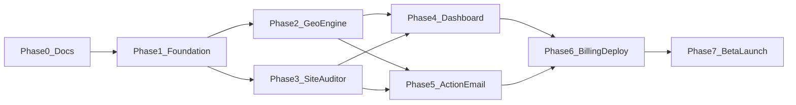

# PitchMind — End-to-End Implementation Plan

> Version: 1.0  
> Last updated: 2026-06-12  
> Duration: 8-10 weeks  
> Related: [PRD.md](./PRD.md) | [system-design.md](./system-design.md) | [progress.md](./progress.md)

---

## Overview

PitchMind is a production GEO audit SaaS. This plan covers full implementation from monorepo scaffold to beta launch with paying users.

**Target outcome:** Public URL, auth + billing, bilingual EN/ID audits, 10 beta users, 1+ paying customer.

**Stack:** Next.js 15, FastAPI, Celery, PostgreSQL (Supabase), Redis (Upstash), **Ollama Cloud** (`gpt-oss:20b-cloud`), Perplexity API, Stripe, Resend.

---

## Phase Summary

| Phase | Weeks | Focus | Exit Criteria |
|-------|-------|-------|---------------|
| **0** | W0 | Documentation | PRD, system-design, Plan approved |
| **1** | W1-2 | Foundation | Sign up, create brand, DB live |
| **2** | W3-4 | Geo Engine | 25-query audit runs, scores stored |
| **3** | W4-5 | Site Auditor | Site audit report with readiness score |
| **4** | W5-6 | Dashboard UI | Bilingual scorecard + audit detail |
| **5** | W6-7 | Action Plan + Email | Ollama Cloud action plan + weekly Resend digest |
| **6** | W7-8 | Billing + Deploy | Stripe tiers, production URL |
| **7** | W8-10 | Beta + Launch | 10 beta users, 1 paying, case study |

---

## Phase 0: Documentation

**Status:** DONE  
**Duration:** 1-2 days

### Tasks

- [x] Write PRD.md
- [x] Write system-design.md
- [x] Write Plan.md
- [x] Write progress.md (initial)
- [x] Create memory.md (empty placeholder)
- [x] Create handoff.md (empty placeholder)
- [ ] Review docs with stakeholder (self-review checklist)

### Exit Criteria

- All 6 doc files exist in `projects/pitchmind/`
- No open questions blocking Phase 1

---

## Phase 1: Foundation (Week 1-2)

### 1.1 Monorepo Scaffold

- [ ] Initialize git repo at workspace root (if not exists)
- [ ] Create `projects/pitchmind/apps/web` — Next.js 15 + TypeScript + Tailwind
- [ ] Create `projects/pitchmind/apps/api` — FastAPI + uvicorn
- [ ] Create `projects/pitchmind/apps/worker` — Celery skeleton
- [ ] Create `projects/pitchmind/packages/geo-engine`, `site-auditor`, `db`, `harness`
- [ ] Root `docker-compose.yml`: postgres, redis (dev only — **no local Ollama**)
- [ ] Shared `pyproject.toml` or requirements per app
- [ ] ESLint + Prettier + Ruff config
- [ ] `.env.example` — include `OLLAMA_API_KEY`, `OLLAMA_CLOUD_HOST`, model names

### 1.2 Database

- [ ] Alembic setup in `packages/db`
- [ ] Migration 001: users, workspaces, brands, competitors, brand_facts
- [ ] Migration 002: golden_queries, audit_runs, query_results
- [ ] Migration 003: site_audits, audit_findings, action_plans, subscriptions
- [ ] Seed script: query templates (saas, local, ecom) EN + ID

### 1.3 Auth

- [ ] Supabase project create
- [ ] Web: Supabase Auth (email + Google)
- [ ] API: JWT middleware validating Supabase tokens
- [ ] Auto-create workspace on first login
- [ ] Protected routes in Next.js middleware

### 1.4 Basic API

- [ ] `GET /health`
- [ ] `POST /api/v1/workspaces`
- [ ] `POST /api/v1/brands` + `PATCH /api/v1/brands/{id}`
- [ ] `POST /api/v1/brands/{id}/competitors`
- [ ] `GET /api/v1/brands/{id}/queries`
- [ ] `POST /api/v1/brands/{id}/queries/seed`

### 1.5 Basic Web

- [ ] Landing page (EN + ID) — hero, features, pricing, CTA
- [ ] Auth pages: login, signup, callback
- [ ] Onboarding wizard: brand name, URL, description, 2 competitors, facts
- [ ] Empty dashboard shell

### 1.6 CI/CD

- [ ] GitHub Actions: lint + test on PR
- [ ] Railway project: API service
- [ ] Vercel project: web (preview on PR)

### Phase 1 Exit Criteria

- User can sign up, complete onboarding, see empty dashboard
- Brand + competitors persisted in Supabase
- API deployed to staging URL
- All migrations run clean

---

## Phase 2: Geo Engine (Week 3-4)

### 2.1 Perplexity Integration

- [ ] `packages/geo-engine/clients/perplexity.py` — API client with retry
- [ ] Rate limiter + cost tracker per workspace
- [ ] Response parser: text + citation URLs

### 2.2 Citation & Mention Parser

- [ ] Brand mention detector (name, domain, fuzzy match)
- [ ] Competitor mention extractor
- [ ] Sentiment classifier (rule-based MVP; Ollama Cloud optional v1.1)

### 2.3 Hallucination Checker

- [ ] Compare extracted claims vs BrandFacts JSON
- [ ] Pricing mismatch detector
- [ ] Feature hallucination flags
- [ ] Unit tests with fixture responses

### 2.4 Scorer

- [ ] Share of Model calculator
- [ ] Citation accuracy calculator
- [ ] Competitor gap index
- [ ] Aggregate scorecard JSON schema

### 2.5 Worker: Visibility Audit Task

- [ ] Celery task `run_visibility_audit(audit_id)`
- [ ] Batch queries with asyncio
- [ ] Progress updates to Redis (for SSE)
- [ ] Persist QueryResults + scorecard
- [ ] Error handling: partial completion

### 2.6 API: Audit Endpoints

- [ ] `POST /api/v1/brands/{id}/audits` — enqueue, tier check
- [ ] `GET /api/v1/audits/{id}` — status + results
- [ ] `GET /api/v1/audits/{id}/stream` — SSE (optional MVP)

### Phase 2 Exit Criteria

- Run 25 golden queries (EN+ID) end-to-end via API
- Scorecard computed and stored
- Audit completes in <5 min on staging
- 5+ unit tests for parser/scorer

---

## Phase 3: Site Auditor (Week 4-5)

### 3.1 Crawler

- [ ] Fetch homepage + `/llms.txt` + `/robots.txt`
- [ ] Timeout + user-agent: `PitchMindBot/1.0`
- [ ] Respect robots; note if blocked

### 3.2 Checks Implementation

- [ ] `llms_txt.py` — presence, markdown links
- [ ] `robots.py` — GPTBot, ClaudeBot, PerplexityBot, anthropic-ai
- [ ] `schema.py` — JSON-LD Organization, LocalBusiness, FAQPage
- [ ] `content.py` — H1, 40-word definition, chunk length analysis
- [ ] `readiness_score.py` — weighted 0-100

### 3.3 Worker Integration

- [ ] Celery subtask `run_site_audit(audit_id)` chained after visibility
- [ ] Store SiteAudit + AuditFindings

### Phase 3 Exit Criteria

- Site audit runs for any public HTTPS URL
- Readiness score appears in audit results
- Findings have severity + recommendation text

---

## Phase 4: Dashboard UI (Week 5-6)

### 4.1 i18n

- [ ] `next-intl` setup with `en`, `id`
- [ ] Translate: nav, onboarding, dashboard, audit labels
- [ ] Language switcher in header

### 4.2 Dashboard Pages

- [ ] `/dashboard` — brand list + latest SoM cards
- [ ] `/dashboard/brands/[id]` — scorecard overview
- [ ] `/dashboard/brands/[id]/audits/[auditId]` — full audit detail
- [ ] Query result table: query, engine, mentioned, sentiment, citations
- [ ] Hallucination alert banners
- [ ] Competitor comparison bar chart
- [ ] Site audit tab with checklist UI

### 4.3 Audit UX

- [ ] "Run Audit" button with loading state
- [ ] Poll or SSE for progress ("12/25 queries...")
- [ ] Empty states + error states
- [ ] Query template selector (SaaS / local / e-commerce)

### 4.4 Settings

- [ ] Brand facts editor
- [ ] Competitor management
- [ ] Custom query add/remove
- [ ] Account settings + language preference

### Phase 4 Exit Criteria

- Full audit flow usable from UI without curl
- EN + ID UI complete for core flows
- Mobile-responsive dashboard

---

## Phase 5: Action Plan + Email (Week 6-7)

### 5.1 Ollama Cloud Action Plan

- [ ] `packages/geo-engine/clients/ollama_cloud.py` — Client host=`https://ollama.com`, Bearer auth
- [ ] Default model: `gpt-oss:20b-cloud` (config via `OLLAMA_ACTION_PLAN_MODEL`)
- [ ] Structured prompt: audit summary -> JSON action items
- [ ] Schema: `{ priority, title, description, effort, locale }`
- [ ] Fallback if Ollama Cloud unavailable: template-based plan
- [ ] Quota monitoring: log usage level per request; alert near limit
- [ ] Sign up Ollama Cloud Pro ($20/mo) before production deploy

### 5.2 Action Plan UI

- [ ] `/dashboard/brands/[id]/audits/[auditId]/actions` tab
- [ ] Checkbox mark-as-done (local state MVP)
- [ ] Copy suggestion buttons

### 5.3 Weekly Email

- [ ] Resend integration
- [ ] HTML email template EN + ID
- [ ] Celery beat cron: Monday 09:00 UTC
- [ ] Content: SoM delta, top hallucinations, top 3 actions
- [ ] Unsubscribe link

### 5.4 PDF Export (P1)

- [ ] `GET /api/v1/audits/{id}/export/pdf` — reportlab
- [ ] Download button in UI

### Phase 5 Exit Criteria

- Action plan generated for every completed audit
- Pro users receive weekly email
- PDF export works

---

## Phase 6: Billing + Production Deploy (Week 7-8)

### 6.1 Stripe

- [ ] Products: Free (internal), Pro $19, Team $49
- [ ] Checkout session for upgrade
- [ ] Customer portal for manage/cancel
- [ ] Webhook: subscription created/updated/deleted
- [ ] Middleware: enforce query limits per tier
- [ ] Usage counter reset monthly cron

### 6.2 Production Deploy

- [ ] Railway: API + Worker (**no Ollama sidecar** — cloud-only LLM)
- [ ] Ollama Cloud API key in Railway secrets
- [ ] Vercel: production domain
- [ ] Supabase production project
- [ ] Upstash Redis production
- [ ] Environment secrets configured
- [ ] Custom domain + SSL

### 6.3 Observability

- [ ] Sentry DSN both apps
- [ ] Langfuse for Ollama Cloud traces (model, latency, tokens)
- [ ] `/health` monitoring (Better Uptime)

### 6.4 Security Hardening

- [ ] CORS lock to production domain
- [ ] Rate limiting middleware
- [ ] Stripe webhook signature verify
- [ ] RLS policies tested

### Phase 6 Exit Criteria

- Production URL live
- Free tier limits enforced
- Upgrade to Pro works end-to-end
- No critical Sentry errors in 48h smoke test

---

## Phase 7: Beta + Launch (Week 8-10)

### 7.1 Beta Program

- [ ] Recruit 10 beta users:
  - 5 EN: Indie Hackers, Twitter/X, Product Hunt upcoming
  - 5 ID: Telegram UMKM groups, local agency Discord
- [ ] Beta feedback form (Google Form or in-app)
- [ ] Fix top 3 UX issues from feedback

### 7.2 GTM

- [ ] Landing page SEO basics + OG tags
- [ ] Product Hunt launch draft
- [ ] Demo video (2-3 min Loom)
- [ ] Portfolio README case study section

### 7.3 Launch

- [ ] Product Hunt launch day
- [ ] Post in relevant communities (EN + ID)
- [ ] Monitor Sentry + user signups

### 7.4 Post-Launch

- [ ] Document case study: before/after SoM for 1 beta brand
- [ ] Update progress.md with metrics
- [ ] Fill memory.md with key decisions
- [ ] Write handoff.md if pausing or handing off

### Phase 7 Exit Criteria

- 10 beta users completed at least 1 audit
- 1+ paying Pro user
- Case study published
- Portfolio links to live URL

---

## Task Count Summary

| Phase | Tasks | Est. Days |
|-------|-------|-----------|
| 0 Docs | 7 | 2 |
| 1 Foundation | 28 | 10 |
| 2 Geo Engine | 18 | 10 |
| 3 Site Auditor | 10 | 5 |
| 4 Dashboard | 16 | 10 |
| 5 Action + Email | 12 | 7 |
| 6 Billing + Deploy | 14 | 7 |
| 7 Beta + Launch | 12 | 14 |
| **Total** | **~117** | **~65 days** |

---

## Definition of Done (Project)

- [ ] Public production URL accessible
- [ ] Supabase auth + Stripe billing operational
- [ ] Full audit: 25 queries EN+ID + site audit + action plan
- [ ] Bilingual UI (en/id) for core flows
- [ ] 10 real beta users (not self-created fake brands)
- [ ] At least 1 paying Pro subscriber
- [ ] Audit completes in <5 minutes (P95)
- [ ] Citation detection precision documented >80% on test set
- [ ] Case study in portfolio README
- [ ] progress.md updated with final metrics
- [ ] handoff.md written if stopping mid-project

---

## Risk Register (Implementation)

| Risk | Phase | Mitigation |
|------|-------|------------|
| Ollama Cloud quota exhausted | 5, 6 | Level 1-2 models only; Ollama Pro $20/mo; cache action plans |
| Ollama Cloud model deprecated | 5 | Config-driven model env vars; monitor deprecation table |
| Perplexity API changes | 2 | Abstract client; integration tests |
| i18n scope creep | 4 | Core flows only; defer settings edge cases |
| Beta user acquisition slow | 7 | Offer free Pro for 3 months to first 10 |
| Solo dev bandwidth | All | Strict MVP; defer P2 features |

---

## Dependencies Between Phases

Phases 2 and 3 can partially overlap after Phase 1 completes.

---

## Next Immediate Actions

1. Deploy to Vercel + Railway (no live Stripe required)
2. Supabase production project + run migrations 001–003
3. Phase 7 beta: recruit 10 users, case study
4. Optional: ChatGPT/Gemini spot-check UI (post-MVP)

See [progress.md](./progress.md) for live status.
