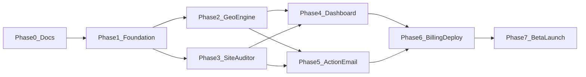

# PitchMind — End-to-End Implementation Plan

> Version: 1.1  
> Last updated: 2026-06-13  
> Duration: 8-10 weeks  
> **Overall:** Phases 0–5 + ROAST hardening **DONE (local)** · Phase 6–7 **pending credentials**  
> Related: [PRD.md](./PRD.md) | [system-design.md](./system-design.md) | [progress.md](./progress.md) | [handoff.md](./handoff.md)

---

## Overview

PitchMind is a production GEO audit SaaS. This plan covers full implementation from monorepo scaffold to beta launch with paying users.

**Target outcome:** Public URL, auth + billing, bilingual EN/ID audits, 10 beta users, 1+ paying customer.

**Stack:** Next.js 15, FastAPI, Celery, PostgreSQL (Supabase), Redis (Upstash), **Ollama Cloud** (`gpt-oss:20b-cloud`), Perplexity API, Stripe, Resend.

---

## Phase Summary

| Phase | Weeks | Focus | Exit Criteria | Status |
|-------|-------|-------|---------------|--------|
| **0** | W0 | Documentation | PRD, system-design, Plan approved | **DONE** |
| **1** | W1-2 | Foundation | Sign up, create brand, DB live | **DONE** (local; staging deploy N/A) |
| **2** | W3-4 | Geo Engine | 25-query audit runs, scores stored | **DONE** (+ semantic ML, harness) |
| **3** | W4-5 | Site Auditor | Site audit report with readiness score | **DONE** (no PageSpeed optional) |
| **4** | W5-6 | Dashboard UI | Bilingual scorecard + audit detail | **DONE** (web polls; SSE API ready) |
| **5** | W6-7 | Action Plan + Email | Ollama Cloud action plan + weekly Resend digest | **DONE** |
| **6** | W7-8 | Billing + Deploy | Stripe tiers, production URL | **PARTIAL** (billing code; no live deploy) |
| **7** | W8-10 | Beta + Launch | 10 beta users, 1 paying, case study | **NOT STARTED** |

### Live status (2026-06-13)

| Area | Done | Pending |
|------|------|---------|
| Product code (Phases 1–5) | Full audit pipeline, EN/ID UI, billing limits, email, PDF | ChatGPT/Gemini engines |
| ROAST / quality | ML eval gate, 41 tests, CI, Redis SSE, PYTHONPATH | — |
| Go-live (Phases 6–7) | Stripe checkout/portal/webhook **code** | Vercel, Railway, Supabase prod, RLS, Sentry, Langfuse, beta users |

---

## Phase 0: Documentation

**Status:** DONE  
**Duration:** 1-2 days

### Tasks

- [x] Write PRD.md
- [x] Write system-design.md
- [x] Write Plan.md
- [x] Write progress.md (initial)
- [x] Create memory.md
- [x] Create handoff.md
- [x] Repo architecture map [STRUCTURE.md](../../STRUCTURE.md)
- [x] Self-review via ROAST + progress sync (2026-06-13)

### Exit Criteria

- All 6 doc files exist in `projects/pitchmind/`
- No open questions blocking Phase 1

---

## Phase 1: Foundation (Week 1-2)

**Status:** DONE (local dev) — staging/production deploy deferred to Phase 6

### 1.1 Monorepo Scaffold

- [x] Initialize git repo at workspace root (if not exists)
- [x] Create `projects/pitchmind/apps/web` — Next.js 15 + TypeScript + Tailwind
- [x] Create `projects/pitchmind/apps/api` — FastAPI + uvicorn
- [x] Create `projects/pitchmind/apps/worker` — Celery skeleton
- [x] Create `projects/pitchmind/packages/geo-engine`, `site-auditor`, `db`, `harness`
- [x] `infra/docker-compose.yml`: postgres, redis (dev only — **no local Ollama**)
- [x] Shared `pyproject.toml` or requirements per app
- [x] ESLint + Prettier + Ruff config
- [x] `.env.example` — include `OLLAMA_API_KEY`, `OLLAMA_CLOUD_HOST`, model names

### 1.2 Database

- [x] Alembic setup in `packages/db`
- [x] Migration 001: users, workspaces, brands, competitors, brand_facts
- [x] Migration 002: golden_queries, audit_runs, query_results (+ billing fields)
- [x] Migration 003: email_digest_enabled (+ subscriptions in schema)
- [x] Seed script: query templates (saas, local, ecom) EN + ID — 25 per template

### 1.3 Auth

- [x] Supabase Auth integration (project = deploy-time credential)
- [x] Web: Supabase Auth (email + Google)
- [x] API: JWT middleware validating Supabase tokens
- [x] Auto-create workspace on first login
- [x] Protected routes in Next.js middleware

### 1.4 Basic API

- [x] `GET /health`
- [x] `POST /api/v1/workspaces`
- [x] `POST /api/v1/brands` + `PATCH /api/v1/brands/{id}`
- [x] `POST /api/v1/brands/{id}/competitors`
- [x] `GET /api/v1/brands/{id}/queries`
- [x] `POST /api/v1/brands/{id}/queries/seed`

### 1.5 Basic Web

- [x] Landing page (EN + ID) — hero, features, pricing, CTA
- [x] Auth pages: login, signup, callback
- [x] Onboarding wizard: brand name, URL, description, 2 competitors, facts
- [x] Dashboard (not empty — full scorecard flow)

### 1.6 CI/CD

- [x] GitHub Actions: lint + **pytest (41)** + ruff + web build
- [ ] Railway project: API service (production)
- [ ] Vercel project: web (production / preview on PR)

### Phase 1 Exit Criteria

- [x] User can sign up, complete onboarding, see dashboard
- [x] Brand + competitors persisted in Postgres
- [ ] API deployed to staging URL
- [x] All migrations run clean

---

## Phase 2: Geo Engine (Week 3-4)

**Status:** DONE — exceeds MVP (semantic ML, AgentHarness, ML eval gate)

### 2.1 Perplexity Integration

- [x] `packages/geo-engine/clients/perplexity.py` — API client with retry + realistic mocks
- [x] Cost tracking per audit (`estimated_cost_usd` in scorecard; AgentHarness budget live mode)
- [x] Response parser: text + citation URLs

### 2.2 Citation & Mention Parser

- [x] Brand mention detector (name, domain, fuzzy match)
- [x] Competitor mention extractor
- [x] Sentiment classifier — **sentence-transformers** + regex fallback

### 2.3 Hallucination Checker

- [x] Compare extracted claims vs BrandFacts JSON
- [x] Pricing mismatch detector
- [x] Feature + **semantic** hallucination flags
- [x] Unit + eval tests with labeled dataset

### 2.4 Scorer

- [x] Share of Model calculator
- [x] Citation accuracy calculator
- [x] Competitor gap index
- [x] Aggregate scorecard JSON schema

### 2.5 Worker: Visibility Audit Task

- [x] Celery task `run_visibility_audit(audit_id)`
- [x] Batch queries with asyncio
- [x] Progress updates to Redis pub/sub (`audit:progress:{id}`)
- [x] Persist QueryResults + scorecard
- [x] Error handling: partial completion

### 2.6 API: Audit Endpoints

- [x] `POST /api/v1/brands/{id}/audits` — enqueue, tier check
- [x] `GET /api/v1/audits/{id}` — status + results
- [x] `GET /api/v1/audits/{id}/stream` — SSE via Redis

### Phase 2 Exit Criteria

- [x] Run 25 golden queries (EN+ID) end-to-end via API
- [x] Scorecard computed and stored
- [ ] Audit completes in <5 min on **production** staging (not validated live)
- [x] 5+ unit tests for parser/scorer (**41 total**)

---

## Phase 3: Site Auditor (Week 4-5)

**Status:** DONE — `performance.py` / PageSpeed optional not implemented

### 3.1 Crawler

- [x] Fetch homepage + `/llms.txt` + `/robots.txt`
- [x] Timeout + user-agent: `PitchMindBot/1.0`
- [x] Respect robots; note if blocked

### 3.2 Checks Implementation

- [x] `llms_txt.py` — presence, markdown links
- [x] `robots.py` — GPTBot, ClaudeBot, PerplexityBot, anthropic-ai
- [x] `schema.py` — JSON-LD Organization, LocalBusiness, FAQPage
- [x] `content.py` — H1, 40-word definition, chunk length analysis
- [x] `readiness_score.py` — weighted 0-100
- [ ] `performance.py` — PageSpeed optional (deferred)

### 3.3 Worker Integration

- [x] Site audit chained in visibility task (same worker run)
- [x] Store SiteAudit + AuditFindings

### Phase 3 Exit Criteria

- [x] Site audit runs for any public HTTPS URL
- [x] Readiness score appears in audit results
- [x] Findings have severity + recommendation text

---

## Phase 4: Dashboard UI (Week 5-6)

**Status:** DONE — web uses polling; SSE API ready for future UI hookup

### 4.1 i18n

- [x] `next-intl` setup with `en`, `id`
- [x] Translate: nav, onboarding, dashboard, audit labels
- [x] Language switcher in header

### 4.2 Dashboard Pages

- [x] `/dashboard` — brand list + latest SoM cards
- [x] `/dashboard/brands/[id]` — scorecard overview
- [x] `/dashboard/brands/[id]/audits/[auditId]` — full audit detail
- [x] Query result table: query, engine, mentioned, sentiment, citations
- [x] Hallucination alert banners (expandable diff)
- [x] Competitor comparison bar chart (`CompetitorGapChart`)
- [x] Site audit findings in audit detail

### 4.3 Audit UX

- [x] "Run Audit" button with loading state
- [x] Poll for progress (SSE endpoint exists; UI not wired yet)
- [x] Empty states + error states
- [x] Query template selector (SaaS / local / e-commerce)

### 4.4 Settings

- [x] Brand facts editor (`/dashboard/brands/[id]/settings`)
- [x] Competitor management
- [x] Custom query add/remove
- [x] Account settings + email preferences

### Phase 4 Exit Criteria

- [x] Full audit flow usable from UI without curl
- [x] EN + ID UI complete for core flows
- [x] Mobile-responsive dashboard

---

## Phase 5: Action Plan + Email (Week 6-7)

**Status:** DONE — action plan on audit detail page (not separate `/actions` route)

### 5.1 Ollama Cloud Action Plan

- [x] `packages/geo-engine/clients/ollama_cloud.py` — Client host=`https://ollama.com`, Bearer auth
- [x] Default model: `gpt-oss:20b-cloud` (config via `OLLAMA_ACTION_PLAN_MODEL`)
- [x] Structured prompt: audit summary -> JSON action items
- [x] Schema: `{ priority, title, description, effort, locale }`
- [x] Fallback if Ollama Cloud unavailable: template-based plan
- [x] Log usage per request
- [ ] Sign up Ollama Cloud Pro ($20/mo) before production deploy

### 5.2 Action Plan UI

- [x] Action plan section on audit detail (`ActionPlanList`)
- [x] Checkbox mark-as-done (local state MVP)
- [x] Copy suggestion buttons
- [ ] Dedicated `/audits/[auditId]/actions` tab route (merged into detail page)

### 5.3 Weekly Email

- [x] Resend integration
- [x] HTML email template EN + ID
- [x] Celery beat cron: Monday 09:00 UTC
- [x] Content: SoM delta, top hallucinations, top 3 actions
- [x] Unsubscribe link + email preferences API

### 5.4 PDF Export (P1)

- [x] `GET /api/v1/audits/{id}/export/pdf` — reportlab
- [x] Download button in UI

### Phase 5 Exit Criteria

- [x] Action plan generated for every completed audit
- [x] Pro/Team users receive weekly email (code ready; needs Resend key + deploy)
- [x] PDF export works

---

## Phase 6: Billing + Production Deploy (Week 7-8)

**Status:** PARTIAL — billing + security code done; production deploy + observability pending

### 6.1 Stripe

- [x] Products: Free (internal), Pro $19, Team $49
- [x] Checkout session for upgrade
- [x] Customer portal for manage/cancel
- [x] Webhook: subscription created/updated/deleted
- [x] Middleware: enforce query limits per tier
- [x] Usage counter reset monthly cron
- [ ] **Stripe live** (keys + end-to-end payment test)

### 6.2 Production Deploy

- [ ] Railway: API + Worker (**no Ollama sidecar** — cloud-only LLM)
- [ ] Ollama Cloud API key in Railway secrets
- [ ] Vercel: production domain
- [ ] Supabase production project
- [ ] Upstash Redis production
- [ ] Environment secrets configured
- [ ] Custom domain + SSL

### 6.3 Observability

- [ ] Sentry DSN both apps
- [ ] Langfuse for Ollama Cloud traces (model, latency, tokens)
- [ ] `/health` monitoring (Better Uptime)

### 6.4 Security Hardening

- [x] CORS configurable via env
- [x] Rate limiting middleware
- [x] Stripe webhook signature verify
- [ ] CORS lock to production domain only
- [ ] Supabase **RLS** policies tested

### Phase 6 Exit Criteria

- [ ] Production URL live
- [x] Free tier limits enforced (code)
- [ ] Upgrade to Pro works end-to-end (live Stripe)
- [ ] No critical Sentry errors in 48h smoke test

---

## Phase 7: Beta + Launch (Week 8-10)

**Status:** NOT STARTED — blocked on Phase 6 deploy

### 7.1 Beta Program

- [ ] Recruit 10 beta users:
  - 5 EN: Indie Hackers, Twitter/X, Product Hunt upcoming
  - 5 ID: Telegram UMKM groups, local agency Discord
- [ ] Beta feedback form (Google Form or in-app)
- [ ] Fix top 3 UX issues from feedback

### 7.2 GTM

- [ ] Landing page SEO basics + OG tags
- [ ] Product Hunt launch draft
- [ ] Demo video (2-3 min Loom)
- [ ] Portfolio README case study section

### 7.3 Launch

- [ ] Product Hunt launch day
- [ ] Post in relevant communities (EN + ID)
- [ ] Monitor Sentry + user signups

### 7.4 Post-Launch

- [ ] Document case study: before/after SoM for 1 beta brand
- [x] Update progress.md with metrics (ongoing)
- [x] Fill memory.md with key decisions
- [x] Write handoff.md

### Phase 7 Exit Criteria

- 10 beta users completed at least 1 audit
- 1+ paying Pro user
- Case study published
- Portfolio links to live URL

---

## Task Count Summary

| Phase | Tasks | Est. Days |
|-------|-------|-----------|
| 0 Docs | 7 | 2 |
| 1 Foundation | 28 | 10 |
| 2 Geo Engine | 18 | 10 |
| 3 Site Auditor | 10 | 5 |
| 4 Dashboard | 16 | 10 |
| 5 Action + Email | 12 | 7 |
| 6 Billing + Deploy | 14 | 7 |
| 7 Beta + Launch | 12 | 14 |
| **Total** | **~117** | **~65 days** |

---

## Definition of Done (Project)

### Product (code) — DONE

- [x] Full audit: 25 queries EN+ID + site audit + action plan
- [x] Bilingual UI (en/id) for core flows
- [x] Tier limits + billing code (Stripe not live)
- [x] Citation/hallucination eval gate in CI (30-item dataset)
- [x] progress.md + handoff.md + memory.md maintained

### Launch — PENDING

- [ ] Public production URL accessible
- [ ] Supabase auth + **Stripe billing live**
- [ ] 10 real beta users (not self-created fake brands)
- [ ] At least 1 paying Pro subscriber
- [ ] Audit completes in <5 minutes (P95) on production
- [ ] Case study in portfolio README
- [ ] Portfolio README links to live demo

---

## Risk Register (Implementation)

| Risk | Phase | Mitigation |
|------|-------|------------|
| Ollama Cloud quota exhausted | 5, 6 | Level 1-2 models only; Ollama Pro $20/mo; cache action plans |
| Ollama Cloud model deprecated | 5 | Config-driven model env vars; monitor deprecation table |
| Perplexity API changes | 2 | Abstract client; integration tests |
| i18n scope creep | 4 | Core flows only; defer settings edge cases |
| Beta user acquisition slow | 7 | Offer free Pro for 3 months to first 10 |
| Solo dev bandwidth | All | Strict MVP; defer P2 features |

---

## Dependencies Between Phases

Phases 2 and 3 can partially overlap after Phase 1 completes.

---

## Next Immediate Actions

1. Deploy to Vercel + Railway (no live Stripe required)
2. Supabase production project + run migrations 001–003
3. Phase 7 beta: recruit 10 users, case study
4. Optional: ChatGPT/Gemini spot-check UI (post-MVP)

See [progress.md](./progress.md) for live status.
