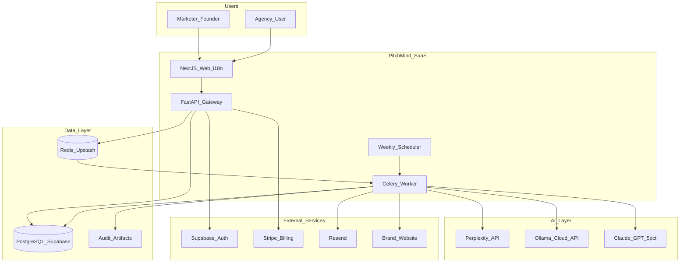
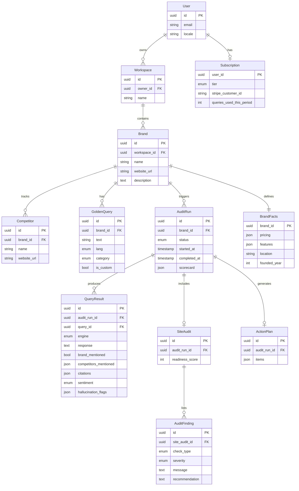
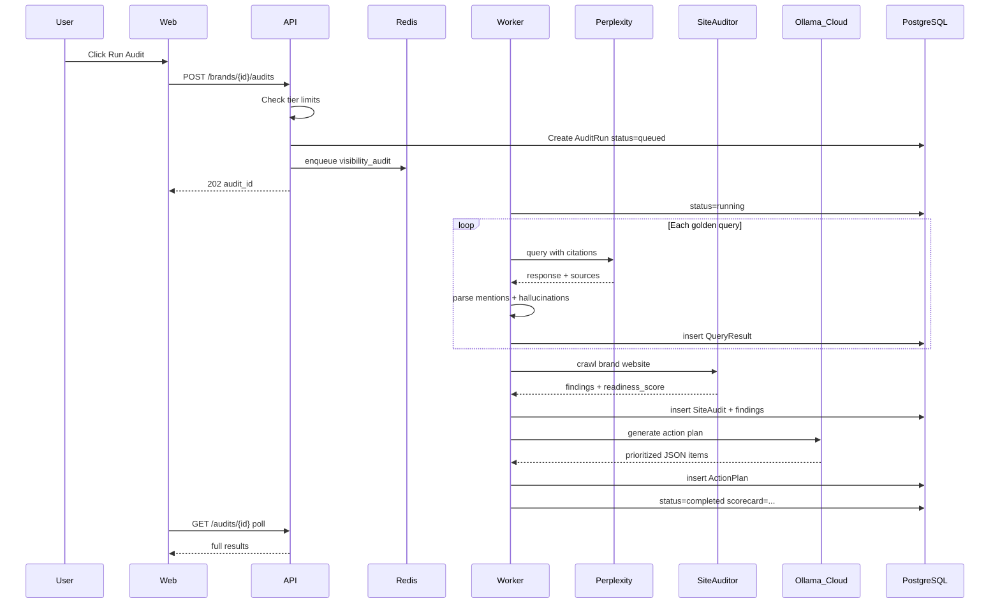
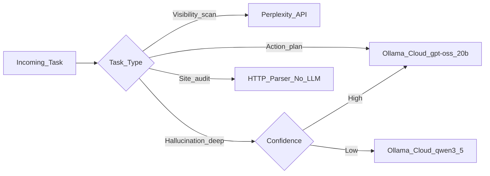
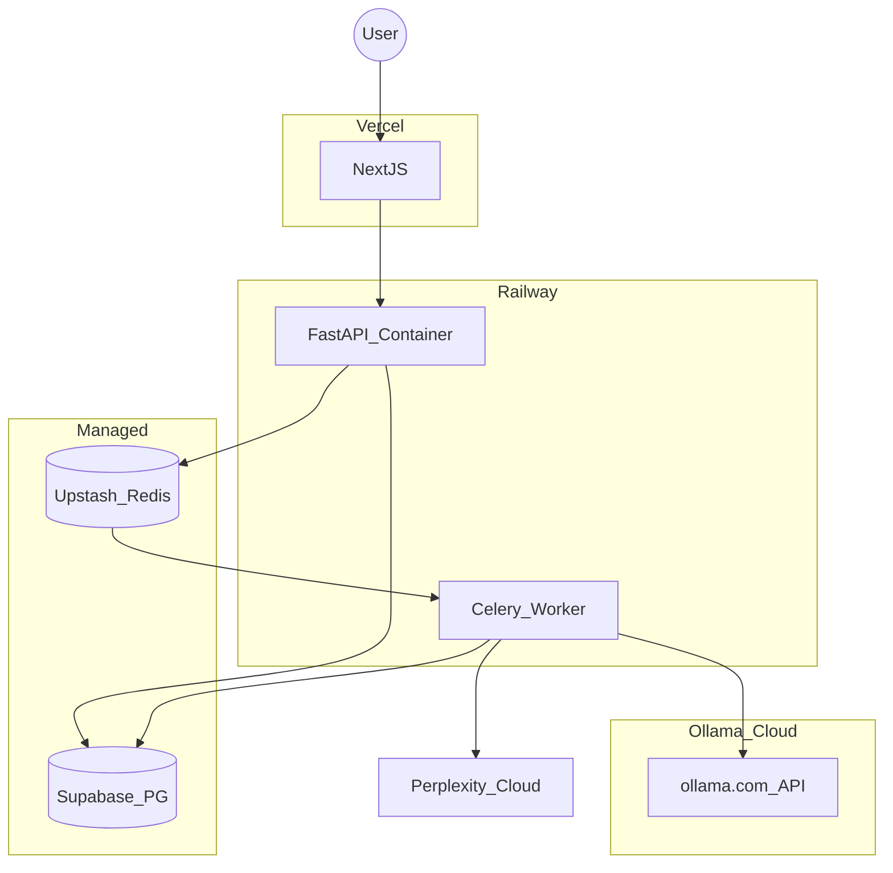

# PitchMind — System Design

> Version: 1.0  
> Last updated: 2026-06-11  
> Status: Implemented (MVP) — see [progress.md](./progress.md)  
> Related: [PRD.md](./PRD.md) | [Plan.md](./Plan.md)

---

## 1. Design Goals

| Goal | Approach |
|------|----------|
| **Low cost** | Ollama Cloud for action plans (no self-hosted GPU); Perplexity API for visibility scans |
| **Bilingual** | i18n at web layer; query sets tagged `en` / `id` |
| **Async audits** | Long-running jobs in worker queue; SSE/poll for status |
| **Multi-tenant** | Workspace-scoped rows; Supabase RLS |
| **Portfolio-grade** | Observability, billing, deploy — not a script |

---

## 2. System Context



---

## 3. Monorepo Structure

```
projects/pitchmind/
├── PRD.md
├── system-design.md
├── Plan.md
├── progress.md
├── memory.md
├── handoff.md
├── apps/
│   ├── web/                 # Next.js 15, App Router, next-intl
│   │   ├── app/[locale]/
│   │   ├── components/
│   │   └── messages/        # en.json, id.json
│   ├── api/                 # FastAPI
│   │   ├── main.py
│   │   ├── routers/
│   │   └── middleware/
│   └── worker/              # Celery
│       ├── tasks/
│       └── celery_app.py
├── packages/
│   ├── geo-engine/          # Query runner, citation parser, scorer
│   ├── site-auditor/        # llms.txt, schema, bot checker
│   ├── harness/             # Budget, retry, circuit breaker
│   └── db/                  # SQLAlchemy models, migrations (Alembic)
├── infra/
│   ├── docker-compose.yml
│   └── railway.toml
└── tests/
    ├── unit/
    └── integration/
```

---

## 4. Component Responsibilities

### 4.1 Web (`apps/web`)

| Responsibility | Detail |
|----------------|--------|
| Auth UI | Supabase Auth client; protected routes |
| Onboarding | Brand setup wizard (3 steps) |
| Dashboard | Scorecard, audit history, competitor comparison |
| Audit detail | Per-query results, citations, hallucination flags |
| Site audit | Technical findings with severity badges |
| Action plan | Prioritized fixes from Ollama Cloud |
| Settings | Billing portal link, email prefs, language |
| i18n | `next-intl`; locales: `en`, `id` |

### 4.2 API (`apps/api`)

| Responsibility | Detail |
|----------------|--------|
| REST API | Versioned `/api/v1/*` |
| Auth middleware | JWT validation via Supabase |
| Billing middleware | Tier limit checks before audit enqueue |
| Job dispatch | Push audit tasks to Redis |
| Webhooks | Stripe subscription events |
| SSE endpoint | Redis pub/sub progress stream (`audit:progress:{id}`); DB fallback poll every 5s |

### 4.3 Worker (`apps/worker`)

| Responsibility | Detail |
|----------------|--------|
| Visibility audit | Batch Perplexity queries |
| Site audit | HTTP crawl + parse |
| Scoring | Aggregate SoM, accuracy, gap |
| Action plan | Call Ollama Cloud API (`https://ollama.com`) |
| Email | Weekly digest via Resend |
| Retry | Exponential backoff on API failures |

### 4.4 Geo Engine (`packages/geo-engine`)

```python
# Core interfaces (conceptual)

class QueryRunner:
    async def run_batch(queries: list[GoldenQuery], engine: Engine) -> list[QueryResult]: ...

class CitationParser:
    def extract_mentions(response: str, brands: list[str]) -> MentionResult: ...

class HallucinationChecker:
    def check(response: str, ground_truth: BrandFacts) -> list[HallucinationFlag]: ...
    # Rule-based pricing/location checks + sentence-transformers semantic similarity

class Scorer:
    def compute_scorecard(results: list[QueryResult]) -> Scorecard: ...
```

### 4.5 Site Auditor (`packages/site-auditor`)

| Module | Function |
|--------|----------|
| `llms_txt.py` | Fetch `/llms.txt`, validate markdown structure |
| `robots.py` | Parse robots.txt for AI bot directives |
| `schema.py` | Extract JSON-LD Organization, LocalBusiness, FAQPage |
| `content.py` | Analyze H1, definition block, chunk lengths |
| `performance.py` | Basic Lighthouse score via PageSpeed API (optional) |

---

## 5. Data Model



### Key Indexes

- `audit_run(brand_id, started_at DESC)`
- `query_result(audit_run_id)`
- `golden_query(brand_id, lang)`
- `subscription(user_id)` + period reset cron

---

## 6. Audit Pipeline



### Audit States

```
queued -> running -> completed
                 -> failed (retry up to 3x)
                 -> partial (some engines failed; still show results)
```

---

## 7. Hybrid Cost Router



| Task | Engine | Est. Cost per Audit |
|------|--------|---------------------|
| 25 Perplexity queries | Perplexity API | $0.25-0.50 |
| Site crawl + parse | None | $0 |
| Action plan | Ollama Cloud (`gpt-oss:20b-cloud`) | ~$0.02-0.08 (quota-based) |
| Hallucination deep analysis (~5%) | Ollama Cloud (`qwen3.5:cloud`) | ~$0.02-0.05 |
| **Total** | | **~$0.30-0.65** |

### Ollama Cloud Integration

Managed inference at [ollama.com](https://ollama.com) — no local GPU, same SDK as local Ollama.

```python
import os
from ollama import Client

client = Client(
    host="https://ollama.com",
    headers={"Authorization": f"Bearer {os.environ['OLLAMA_API_KEY']}"},
)
response = client.chat(
    model="gpt-oss:20b-cloud",
    messages=[{"role": "user", "content": prompt}],
)
```

| Model (MVP) | Use Case | Usage Level |
|-------------|----------|-------------|
| `gpt-oss:20b-cloud` | Action plan generation | Level 1 (light) |
| `qwen3.5:cloud` | Hallucination deep analysis, bilingual ID | Level 2 |
| `gpt-oss:120b-cloud` | Optional Pro-tier rich reports | Level 3 (heavy) |

**Account tiers ([Ollama Cloud pricing](https://ollama.com/pricing)):**
- Free: base cloud quota — sufficient for dev/testing
- Pro ($20/mo): ~50x quota, full catalog, 3 concurrent — **recommended for MVP production**
- Max ($100/mo): production agent workloads at scale

**Privacy:** Ollama Cloud does not retain inference data ([source](https://ollama.com/blog/cloud-models)).

### Caching Strategy

- Perplexity responses: cache key = `hash(query + engine + date_bucket)` TTL 7 days
- Site audit: cache 24h unless user triggers force refresh
- Action plan: regenerate only on new audit run

---

## 8. API Specification (MVP)

### Auth

All endpoints require `Authorization: Bearer <supabase_jwt>` except health check.

### Endpoints

| Method | Path | Description |
|--------|------|-------------|
| GET | `/health` | Liveness |
| POST | `/api/v1/workspaces` | Create workspace |
| GET | `/api/v1/workspaces/{id}/brands` | List brands |
| POST | `/api/v1/brands` | Create brand + facts |
| PATCH | `/api/v1/brands/{id}` | Update brand |
| POST | `/api/v1/brands/{id}/competitors` | Add competitor |
| GET | `/api/v1/brands/{id}/queries` | List golden queries |
| POST | `/api/v1/brands/{id}/queries` | Add custom query |
| POST | `/api/v1/brands/{id}/queries/seed` | Load template (saas/local/ecom) |
| POST | `/api/v1/brands/{id}/audits` | Start audit (async) |
| GET | `/api/v1/audits/{id}` | Audit status + results |
| GET | `/api/v1/audits/{id}/stream` | SSE progress events |
| GET | `/api/v1/brands/{id}/scorecard` | Latest scorecard |
| GET | `/api/v1/brands/{id}/audits` | Audit history |
| GET | `/api/v1/audits/{id}/export/pdf` | PDF report |
| POST | `/api/v1/webhooks/stripe` | Stripe events |

### Example: Start Audit

```http
POST /api/v1/brands/{brand_id}/audits
Content-Type: application/json

{
  "engines": ["perplexity"],
  "languages": ["en", "id"],
  "include_site_audit": true,
  "include_action_plan": true
}
```

```http
HTTP/1.1 202 Accepted

{
  "audit_id": "550e8400-e29b-41d4-a716-446655440000",
  "status": "queued",
  "estimated_duration_seconds": 180
}
```

---

## 9. Scoring Logic

### Share of Model (SoM)

```
SoM = (queries_where_brand_mentioned / total_queries) * 100
```

Brand "mentioned" if: name appears in response OR cited URL domain matches brand site OR explicitly recommended.

### Citation Accuracy

For each mention, compare extracted facts against `BrandFacts`:
- Pricing match (fuzzy ±10%)
- Feature claims subset of ground truth
- Location match

```
Accuracy = (correct_mentions / total_mentions) * 100
```

If no mentions, accuracy = N/A (shown separately).

### AI Readiness Score

Weighted sum of site audit checks (see PRD section 4.5). Each check: pass=100, partial=50, fail=0.

### Competitor Gap Index

```
Gap = SoM(brand) - max(SoM(competitor_i))
```

Negative gap = competitor ahead.

---

## 10. Security

| Layer | Measure |
|-------|---------|
| Auth | Supabase JWT; short-lived tokens |
| Authorization | Workspace membership check on every request |
| RLS | PostgreSQL policies: `workspace_id = auth.workspace()` |
| API keys | Perplexity + Ollama Cloud keys server-side only; never exposed to client |
| Rate limiting | 100 req/min per user; audit 1 concurrent per brand |
| Input validation | URL allowlist scheme (https); query length max 500 chars |
| Stripe webhooks | Signature verification |
| Data isolation | Audit data scoped to workspace; no cross-tenant queries |

---

## 11. Infrastructure

| Component | Service | Tier / Cost |
|-----------|---------|-------------|
| Frontend | Vercel | Free -> Pro $20/mo |
| API | Railway | $5-10/mo |
| Worker | Railway | $5-10/mo |
| PostgreSQL | Supabase | Free (500MB) |
| Redis | Upstash | Free (10K cmds/day) |
| Ollama Cloud | ollama.com API | Free tier dev; Pro $20/mo production |
| Object storage | Supabase Storage | Free tier for PDF exports |
| Email | Resend | Free 3K/mo |
| Perplexity API | Pay-as-go | ~$10-20/mo at MVP |
| Domain | Cloudflare | ~$12/year |
| Monitoring | Sentry + Langfuse self-host | Free tiers |

**Estimated MVP total: $25-45/month** (includes Ollama Cloud Pro $20/mo)

### Environment Variables

```bash
# API + Worker
DATABASE_URL=
REDIS_URL=
SUPABASE_URL=
SUPABASE_SERVICE_KEY=
SUPABASE_JWT_SECRET=
PERPLEXITY_API_KEY=
OLLAMA_API_KEY=              # from https://ollama.com/settings/keys
OLLAMA_CLOUD_HOST=https://ollama.com
OLLAMA_ACTION_PLAN_MODEL=gpt-oss:20b-cloud
OLLAMA_DEEP_ANALYSIS_MODEL=qwen3.5:cloud
STRIPE_SECRET_KEY=
STRIPE_WEBHOOK_SECRET=
RESEND_API_KEY=
SENTRY_DSN=
LANGFUSE_PUBLIC_KEY=
LANGFUSE_SECRET_KEY=

# Web
NEXT_PUBLIC_SUPABASE_URL=
NEXT_PUBLIC_SUPABASE_ANON_KEY=
NEXT_PUBLIC_API_URL=
```

---

## 12. Deployment Architecture



### CI/CD

- GitHub Actions: lint, test, build Docker images
- Push to `main` -> deploy API/Worker to Railway
- Vercel auto-deploy on `main` for web
- DB migrations via Alembic in deploy pipeline

---

## 13. Observability

| Signal | Tool | Alerts |
|--------|------|--------|
| Errors | Sentry | Slack on new issue |
| LLM traces | Langfuse | Token/cost per audit; Ollama Cloud model + latency |
| Metrics | Prometheus (optional) | Audit duration P95 > 10min |
| Logs | Structured JSON stdout | Railway log drain |
| Uptime | Better Uptime (free) | API /health down |

**Key dashboards:**
- Audits completed / failed per day
- Avg cost per audit
- Perplexity API error rate
- Ollama Cloud action plan latency
- Ollama Cloud quota usage vs plan limit

---

## 14. Failure Modes

| Failure | Behavior |
|---------|----------|
| Perplexity rate limit | Backoff + retry; partial results if exhausted |
| Ollama Cloud API down / quota exceeded | Skip action plan; template fallback; queue retry; alert on quota |
| Ollama Cloud model deprecated | Config-driven model name; monitor Ollama deprecation notices |
| Site crawl blocked | Site audit partial; note robots block |
| Worker crash mid-audit | Job requeued; idempotent result writes |
| Stripe webhook miss | Reconcile via daily cron |

---

## 15. Future Architecture (v2)

- **Agency mode:** parent workspace -> child brand workspaces
- **API product:** public API key for programmatic audits
- **MCP server:** expose brand facts as MCP resource for AI agents
- **Multi-engine parallel:** asyncio gather for all engines
- **Embedding competitor analysis:** vector similarity of AI responses over time

---

## References

- [PRD.md](./PRD.md)
- [Plan.md](./Plan.md)
- Shared harness patterns from portfolio research: hybrid router, agent harness, trajectory eval
